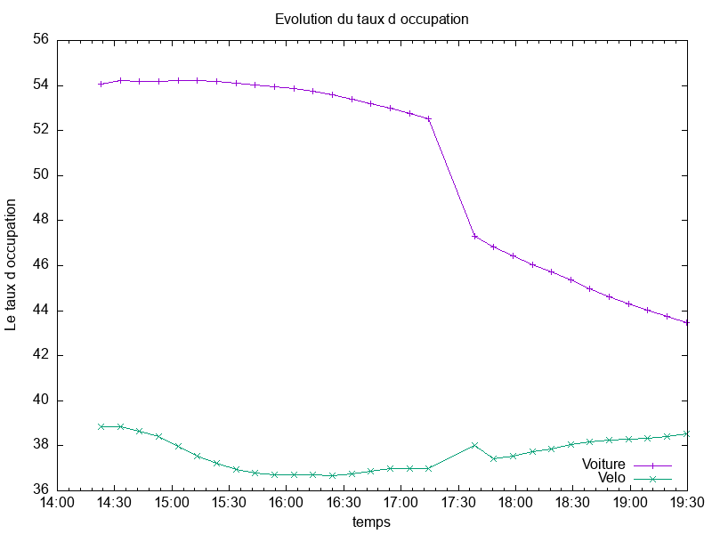
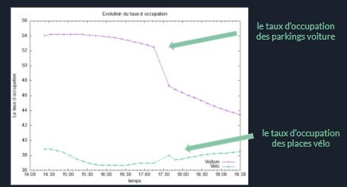

# Etude de l'utilisation des parkings de la ville de Montpellier
 
Nous voulons nous intéresser sur:
- Le taux d’occupation des parkings voiture.
- Le taux d’occupation des parkings vélos.
- Le bon fonctionnement du relais voiture / vélo.
- La relation entre l'usage des parkings voiture et l'usage des parkings velo
 
Pour ce faire, nous allons utiliser les données extraites du site ***open data de Montpellier*** et faire des programmes permettant d'aboutir à nos fins.
 
>_Afin d’envoyer une requête http pour récupérer les données de tous les parkings, nous utiliserons la librairie ***« requests »***_

````php
import requests
 
 
PAR=['FR_MTP_ANTI','FR_MTP_COME','FR_MTP_CORU','FR_MTP_EURO','FR_MTP_FOCH','FR_MTP_GAMB','FR_MTP_GARE','FR_MTP_TRIA','FR_MTP_ARCT',
'FR_MTP_PITO','FR_MTP_CIRC','FR_MTP_SABI','FR_MTP_GARC','FR_MTP_SABL','FR_MTP_MOSS','FR_STJ_SJLC','FR_MTP_MEDC','FR_MTP_OCCI','FR_CAS_VICA','FR_MTP_GA109','FR_MTP_GA250','FR_CAS_CDGA','FR_MTP_ARCE','FR_MTP_POLY']
 
for i in PAR:
    x=requests.get(f'https://data.montpellier3m.fr/sites/default/files/ressources/{i}.xml')
    print(x.text)
 
````
 
>***Ceci est un programme  qui permet le suivi de l’occupation de tous les parkings de Montpellier et en affichant à la fin le pourcentage de places libres  et de places occupées de toute la ville.***
````php
import requests
from lxml import etree
PAR=['FR_MTP_ANTI','FR_MTP_COME','FR_MTP_CORU','FR_MTP_EURO','FR_MTP_FOCH','FR_MTP_GAMB','FR_MTP_GARE','FR_MTP_TRIA','FR_MTP_ARCT',
'FR_MTP_PITO','FR_MTP_CIRC','FR_MTP_SABI','FR_MTP_GARC','FR_MTP_SABL','FR_MTP_MOSS','FR_STJ_SJLC','FR_MTP_MEDC','FR_MTP_OCCI','FR_CAS_VICA','FR_MTP_GA109','FR_MTP_GA250','FR_CAS_CDGA','FR_MTP_ARCE','FR_MTP_POLY']
 
y=0
w=0
p=0
for i in PAR:
    x=requests.get(f'https://data.montpellier3m.fr/sites/default/files/ressources/{i}.xml')
    f1=open(f'{i}.txt',"w", encoding='utf8')
    f1.write(x.text)
    f1.close()
    tree = etree.parse(f"{i}.txt")   #retirer les donnees
    for user in tree.xpath("Name"):    #extrait les données de name
        print('Nom du parking :',user.text)
    for user1 in tree.xpath("Total"):  
        print('Places totales :',user1.text)
    for user2 in tree.xpath("Free"):
        print('Nombre de places libres :',user2.text)
        x=int((user1.text))-int((user2.text))
        print('Nombres de places occupées:' ,x)
    y=int((user1.text))+ y
    w=int((user2.text))+w
    p=int((x))+ p
#print('Nombres de places occupées dans toute la ville:' ,x)
print('Nombre de Places totales de toute la ville:' ,y)
print('Nombres de places libres de toute la ville:' ,w)
print('Nombre de place occupées dans toute la ville:' ,p)
pour=int((w))*100/int(y)
opour=int((p))*100/int(y)
print('Pourcentage de places libres de toute la ville' ,round(pour,2) ,'%')
print('Pourcentage de places occupées de toute la ville' ,round(opour,2) ,'%')
````
Voici les résultats du meme programme mais qui sont lancés à des heures differents.<br>
>Celui ci est lancé à 15h:


>Celui ci est lancé à 00h:


_On voit une nette difference entre les 2 résultats car évidemment que pendant la nuit que ça soit les travailleurs, ce qui font des courses etc presque tout le monde rentre chez eux et donc la ville n'est plus en mouvement et conséquence,les parkings ne sont plus occupés._
 
## ***Bref on va maintenant afficher notre programme général qui fait à la fois:***
>- Une requête https et récupère les fichiers xml qui se trouve dans la page, les enregistre dans un fichier.<br>
>- Permettre à l’utilisateur de choisir la période d’échantillonnage Te et la durée de l’acquisition.
>- Récupérer les données précise avec la librairie “parser”<br>
>- Calcule le taux d’occupation des parkings voitures et vélos sur un intervalle en affichant l’heure, la minute et la seconde dans un autre fichier.<br>
>- Et enfin, qui va calculer la corrélation et la covariance qu’il ya entre les parkings vélos et voitures
 

````php
import requests
from lxml import etree
import time
parkings=['FR_MTP_ANTI','FR_MTP_COME','FR_MTP_CORU','FR_MTP_EURO','FR_MTP_FOCH','FR_MTP_GAMB','FR_MTP_GARE','FR_MTP_TRIA','FR_MTP_ARCT','FR_MTP_PITO','FR_MTP_CIRC','FR_MTP_SABI','FR_MTP_GARC','FR_MTP_SABL','FR_MTP_MOSS','FR_STJ_SJLC','FR_MTP_MEDC','FR_MTP_OCCI','FR_CAS_VICA','FR_MTP_GA109','FR_MTP_GA250','FR_CAS_CDGA','FR_MTP_ARCE','FR_MTP_POLY']
Toville=0 #Le nombre total des parkings de toute la ville
FrVille=0 #Le nombre total des parkings libre de toute la ville
ToVelo=0 #Le nombre total des places du velo de toute la ville
AvVelo=0 #le nombre total des places occupées du vélo de toute la ville
# Pour saisir la période et la durée
period=int(input("Période(min):"))
period=period*60
duration=int(input("duration(sec):"))
t=int(period/duration)
# t est le nombre de fois que ce programme doit être exécuté.
for p in range(t):
    for x in parkings: #La liste "parkings" contient les noms des fichiers de chaque zone. On fait une boucle pour récupérer des données de chaque zone.
        #Récupérer les données et les mettre dans un nouveau fichier
        data=requests.get(f"https://data.montpellier3m.fr/sites/default/files/ressources/{x}.xml")
        f1=open(f"{x}.txt","w",encoding='utf8')
        f1.write(data.text)
        f1.close()
        #trier des données et choisir le nombre des places libres et des places totales.
        tree=etree.parse(f"{x}.txt")
        a=0
        b=0
        for user in tree.xpath("Total"):
            total=int(user.text)
            a=a+total
        for user in tree.xpath("Free"):
            libre=int(user.text)
            b=b+libre
        # ajouter des nombre dans le valeur du "nombre total". C'est pour obtenir la somme de tous les parkings et tous les parkings libres
        Toville=Toville+a
        FrVille=FrVille+b
    # Récupérer des données de places du vélo
    data2=requests.get("https://data.montpellier3m.fr/sites/default/files/ressources/TAM_MMM_VELOMAG.xml")
    f3=open("VELO.txt","w",encoding='utf8')
    f3.write(data2.text)
    f3.close()
    # Trier
    tree2=etree.parse("VELO.txt")
    for user in tree2.xpath('//si/@av'):
        av=int(user)
        AvVelo=AvVelo+av
    for user in tree2.xpath('//si/@to'):
        to=int(user)
        ToVelo=ToVelo+to
    PourcentVelo=AvVelo/ToVelo # le valeur : Places occupées du vélo / Places total du vélo
    PercentVoiture=FrVille/Toville # le valeur : Parkings libres/ Parkings total
    PercentVoiture=1-PercentVoiture # pour obtenir le taux d'occupation de voiture
    temps=time.time()
    temps=time.ctime(temps)
    t=temps.split(' ')
    f2=open("Data.txt","a",encoding='utf8')
    f2.write(f"{t[3]}    {round(PercentVoiture*100, 2)}%    {round(PourcentVelo*100, 2)}%")
    f2.write('\n')
    f2.close()
    time.sleep(duration)
````
>Ici, nous avons d’abord créé un objet de réponse HTTP en envoyant une requête HTTP à l’URL. Le contenu de la réponse contient maintenant les données du fichier XML que nous enregistrons sous le nom data.text dans notre répertoire local.<br>
 
 
Dans notre programme notre durée d'acquisition est de 5 heures et la période d'échantillonnage correspond à 10 c'est-à-dire qu'il récupère le taux d'occupation des parkings chaque 10 minutes pendant 5 heures de temps.
 
Ce fichier data contient les pourcentages d'occupation:

 
 
## Pourcentage
Comme le programme au-dessus avait calculé le taux d’occupation des parkings voitures et vélos sur un intervalle et l'avait enregistré sur un fichier.<br> Maintenant ceci va nous permettre de récupérer tous les pourcentages et de calculer la corrélation et la covariance.

````php
f4=open('Data.txt','r', encoding="utf8")
lines=f4.readlines()
f4.close()
Lvoiture=[]
Lvelo=[]
 
for do in lines:
    L=do.split('   ')
    x=float(L[1].strip('%'))
    y=float(L[2].strip('%\n'))
    Lvoiture.append(x)
    Lvelo.append(y)
print(Lvoiture,Lvelo)
# Lvoiture est la liste des pourcentages de voiture et Lvelo est celle de velo
   
# Covariance
somme=0
for x in range(len(Lvoiture)):
    a=Lvoiture[x]-moyenne1(Lvoiture)
    b=Lvelo[x]-moyenne2(Lvelo)
    c=a*b
    somme=somme+c
cov=somme/len(Lvoiture)
 
 
# Corrélation
Cor=cov/sqrt(sigma(Lvoiture)*sigma(Lvelo))
print("Covariance:",cov,"corrélation:",Cor)
 
````
## Covariance et Corrélation
Le coefficient de corrélation est un indice de mesure de l’intensité d’un lien qui peut exister entre deux variables. <br>Le coefficient de corrélation est basé sur la covariance, c’est pourquoi on l'a calculé en premier.
On a un coefficient de corrélation de -0,8 cette valeur correspond à une valeur qui croît à mesure que la première décroît.<br>
On peut donc dire qu'elles sont fortement corrélées mais attention cela ne veut pas forcément dire qu’il y a une relation de causalité. Mais le résultat est négatif, on déduit qu’ils évoluent inversement.


>Voici ce que nous avons obtenu comme covariance et corrélation:
 


Pour plus d'éclaircissement, allons voir leurs courbes d’évolution.


## GNUPLOT
Ceci est un logiciel interactif en ligne de commande qui sert à produire des représentations graphiques en deux ou trois dimensions. <br>
Nous l'avons installé et il ne reste plus qu'à lui donner un programme pour qu'il nous trace l'évolution du taux d'occupation en fonction du temps
Voici le programme:

````php
set terminal png size 800,600
set output 'image.png'
set key inside bottom right
set autoscale
set xlabel 'temps'
set xdata time
set timefmt "%H:%M:%S"
set format x "%H:%M"
set ylabel 'Le taux d occupation'
set title "Evolution du taux d occupation"
plot "Data.txt" using 1:2 title 'Voiture' with linespoints, "Data.txt" using 1:3 title 'Velo' with linespoints
````
>Voici l'image qu'il a généré:
 



Maintenant nous retrouvons exactement ce qu'on avait interpréter sur la corrélation. On voit que lorsque le taux d'occupation des parkings voiture tend à decroitre, celui des vélos augmente progressivement. 

## Relation
- Comme la plupart des gens travaillent dans le centre-ville pendant la journée, leurs voitures sont garées dans ces parkings, qui ont un taux d'occupation élevé.<br> 
- Et comme il est plus facile de se déplacer en vélo dans le centre-ville, l'utilisation du vélo est plus élevée, donc le taux d'occupation des places vélo est faible. 
- Mais en fin de journée, les gens commencent à rentrer chez eux, de sorte que l'utilisation des voitures commence à augmenter et le taux d'occupation des parkings voitures diminue et celui des vélos commencent à croître.<br> 
- Ceci a aussi un impact sur l'utilisation des vélos, donc le taux d'occupation des places vélo augmente légèrement.<br><br>
>_On voit que la différence entre l’usage des vélos et des voitures est particulièrement sensible aux heures de grande affluence ou le vélo prend définitivement  le large._<br>
>_Un avantage encore accru par la multiplication des aménagements cyclables liés à la crise sanitaire. Les automobilistes ne disposant pas de parking devront en plus composer avec la recherche d’une place de stationnement. Souvent une véritable quête au long cours et donc le vélo va prendre le relais._


 
 
 
